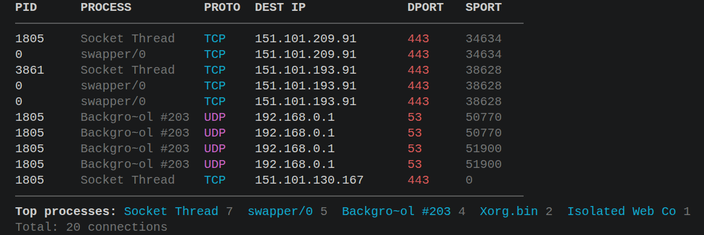

# KConnect-Core
#### Execution Instructions:
* Compile the display program: `gcc -o kconnectcore kconnectcore.c`
* Run the pipeline: `sudo bpftrace kconnectcore.bt | ./kconnectcore`

## Stuff

- kconnectcore.c excepts input in the format: "PID|PROCESS_NAME|PROTOCOL|DEST_IP|DPORT|SPORT" (used an LLM, i don't understand c very well)

- It expects data continuosly, receives 10 valid items and then refreshes terminal.

- learnt about how ebpf works, but i don't really feel confident scripting with it.

- was not able to find the required probe ( i could've used `bpftrace -l`) , ended up asking an LLM which suggested `tracepoint:sock:inet_sock_set_state` i'm sure there are plenty of other ways to do it.

- figuring out datatypes and arguments available from a trace can be done by using `sudo bpftrace -l <probe> -v`

- some types had to be coverted for example, the destination ip which is an array (see `sudo bpftrace -l "tracepoint:sock:inet_sock_set_state" -v`) had to be converted to string.

- the `tracepoint:sock:inet_sock_set_state` probe only fires for TCP connections, if we want to be able to observe other protocol connections such as udp, we will have to switch to a diff probe or add other probes, i also noticed that there is no decoding from protocol number to proctol name in the c program, so in the bpftrace script we will have to map protocol number to name.

- find v1 of the script in ./kconnectcore_V1.bt [for protocol part of the input, i'd just harcoded TCP, so in the screenshots you might notice just TCP connections]

- I've added UDP (haven't done ICMP SCTP) into the final script, there;s a lot of stuff like macrolimits and binary swapping thaty i don't understand and will explore at a later time

### Final Output

There are more images in the ./Assets/ folder, the curl requests are to produce TCP requests

### Commands
- `chmod +x filename`

### Resources 

- https://github.com/bpftrace/bpftrace/blob/master/docs/tutorial_one_liners.md
- https://ebpf.io/what-is-ebpf/
- https://ebpf.io/books/buzzing-across-space-illustrated-childrens-guide-to-ebpf.pdf (very good book)